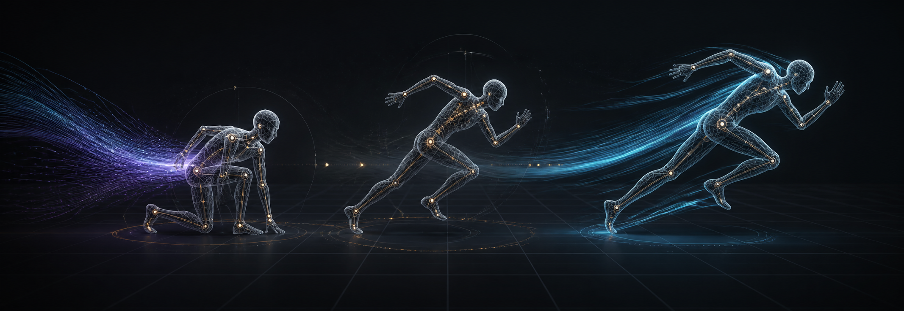
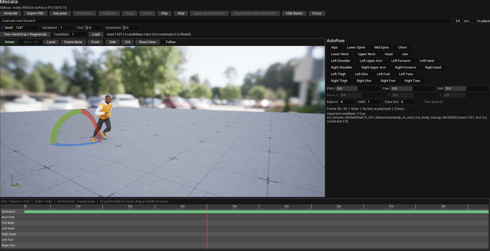
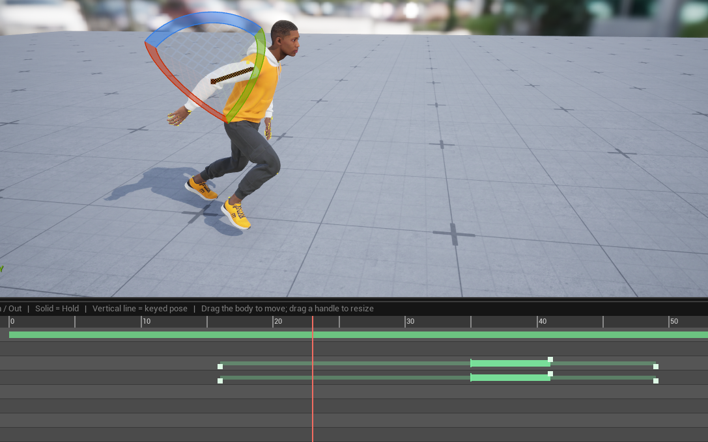
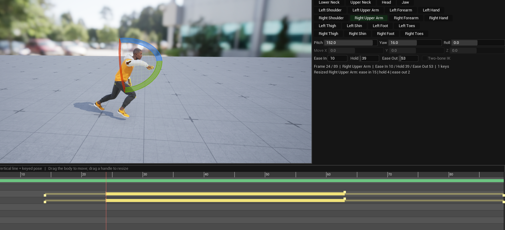
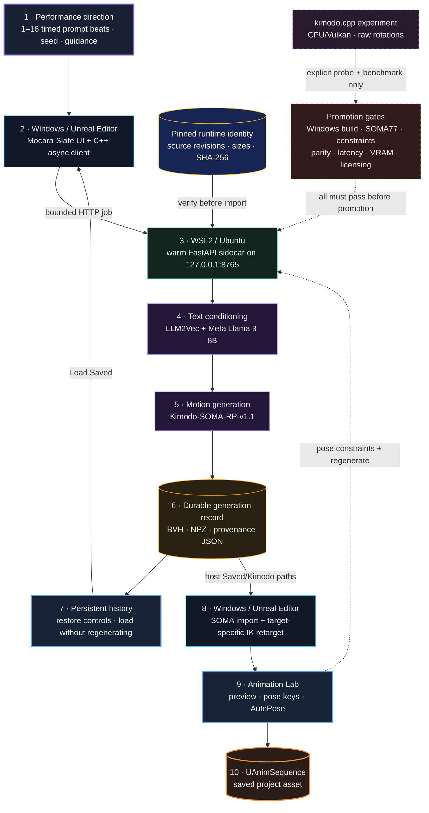

<p align="center">
  
</p>

<h1 align="center">Mocara</h1>

<p align="center">
  <strong>Text to motion. Motion to an Unreal asset.</strong><br>
  Local character-motion generation, retargeting, and pose-directed refinement inside Unreal Engine 5.8.
</p>

<p align="center">
  <a href="https://github.com/Conalh/Mocara-Unreal/actions/workflows/ci.yml"></a>
  
  
  
  
  <a href="LICENSE"></a>
</p>

<p align="center">
  <a href="#see-it-in-the-editor">See it</a> ·
  <a href="#how-mocara-works">How it works</a> ·
  <a href="#quick-start">Install</a> ·
  <a href="#animation-lab">Author motion</a> ·
  <a href="#development">Develop</a> ·
  <a href="docs/ARCHITECTURE.md">Architecture</a>
</p>

Mocara is a beta Unreal Engine editor plugin that turns a performance prompt into skeletal motion, imports the result, retargets it onto a UE5 mannequin or MetaHuman body, and gives the animator a focused in-editor lab for exact pose corrections.

> [!IMPORTANT]
> Mocara 0.3.0 currently supports **Windows 10/11 + WSL2 Ubuntu + NVIDIA GPUs**. This repository contains the plugin source—not Kimodo or Llama model weights, downloaded checkpoints, or Epic content.

## What you can do

| Generate and compare | Retarget and preview |
| --- | --- |
| Create body motion from one or more timed prompt beats with a reproducible seed, independent guidance controls, and one to four sequential candidates. | Import SOMA BVH motion, build or reuse target-specific IK assets, and preview it on UE5 mannequin or assembled MetaHuman bodies. |
| **Direct and refine** | **Reproduce and inspect** |
| Key exact bones, shape Ease In / Hold / Ease Out intervals, apply local AutoPose, or send pose constraints back through Kimodo. | Verify exact model inputs, preserve the complete generation in provenance, and reload prior results from persistent history. |

The model service stays warm between requests, so Mocara can support an authoring loop rather than treating every generation as a disconnected batch job.

## See it in the editor

[](docs/images/animation-lab-overview.png)

*Animation Lab keeps generation, preview, camera controls, bone selection, pose timing, and candidate provenance in one Unreal editor tab.*

| Two-hand relationship constraint | Per-bone pose interval |
| --- | --- |
| [](docs/images/two-hand-grip.png) | [](docs/images/pose-constraint-timeline.png) |
| Preserve a moving midpoint and the clip's existing hand spacing, then regenerate without baking in a sword-, rifle-, or tool-specific distance. | Rotate or move a supported bone, then shape when the correction enters, holds at full influence, and releases. |

## How Mocara works



The language model is **not** the animation generator:

1. **Meta Llama 3 8B + LLM2Vec** encode the prompt into conditioning vectors.
2. **Kimodo-SOMA-RP-v1.1** uses that conditioning, the seed, guidance, and optional pose constraints to synthesize skeletal motion.
3. **Mocara** owns the Windows/WSL bridge, import, IK retargeting, preview, local editing, constraint feedback, and Unreal asset creation.

Before Kimodo loads, Mocara resolves exact repository revisions and verifies every
declared runtime configuration and weight file against the packaged manifest. The
bundle digest then travels with each generation's provenance. Completed records remain
available after either process restarts; loading one restores its prompt timeline and
imports the chosen artifact without another model call.

The dashed `kimodo.cpp` branch is deliberately not a selectable backend. It exposes a
measurable native experiment while the production Python/CUDA path retains constraints,
SOMA 77-joint presentation output, BVH generation, and the proven editor contract.

The generation path is local to one workstation. Setup downloads the required code and gated model assets from their original providers; after they are installed, prompts and generated motion travel only between Unreal and the loopback WSL sidecar.

The complete component boundaries, data contracts, extension seams, and verification layers live in [`docs/ARCHITECTURE.md`](docs/ARCHITECTURE.md).

## The authoring loop

```text
Author one or more timed prompt beats
        ↓
Generate broad motion and compare candidates
        ↓
Inspect it on the target character
        ↓
Load a saved generation ─── or ─── Key exact body corrections
        ↓                                      ↓
Reuse the artifact              Apply locally or regenerate
        ↓
Save the chosen UAnimSequence
```

This split keeps creative iteration fast:

- **Local AutoPose** deterministically bakes keyed corrections onto the loaded clip without another model request.
- **Constraint regeneration** turns keyed body, root, or end-effector targets into a new Kimodo request when the motion itself should adapt.
- **Candidate comparison** derives deterministic variation seeds and generates sequentially, keeping peak VRAM at the proven single-motion level.
- **Prompt sequences** give every motion beat its own text and duration, with an explicit transition width.
- **Persistent history** restores completed generation controls and artifacts without rerunning the model.
- **Two-Hand Grip** describes a relationship between both wrists while preserving the selected clip's broad motion.

## Quick start

### Requirements

- Windows 10 or 11 with WSL2 and an Ubuntu distribution.
- Unreal Engine 5.8 and its Windows C++ build toolchain.
- An NVIDIA CUDA-capable GPU with a current Windows driver.
- Git available inside WSL.
- A Hugging Face account with gated access to:
  - [`meta-llama/Meta-Llama-3-8B-Instruct`](https://huggingface.co/meta-llama/Meta-Llama-3-8B-Instruct)
  - [`nvidia/Kimodo-SOMA-RP-v1.1`](https://huggingface.co/nvidia/Kimodo-SOMA-RP-v1.1)
- A Hugging Face read token kept outside the repository.

### Install the plugin

Clone this repository as `Mocara` inside the host project's `Plugins` directory:

```powershell
git clone https://github.com/Conalh/Mocara-Unreal.git <ProjectRoot>\Plugins\Mocara
```

Regenerate the host project's IDE files if needed, build its editor target, and open Unreal. Enable **Mocara**, **IK Rig**, and **Control Rig** if prompted, then restart the editor.

Open **Window → Mocara** and run the preflight before installing anything:

```text
Mocara.Doctor
```

When the reported prerequisites are ready, provision or repair the pinned WSL environment:

```text
Mocara.Setup
```

Setup installs `uv`, Python 3.10, a virtual environment, a GPU-matched PyTorch build, and a pinned Kimodo revision. It is rerunnable and safe to interrupt.

<details>
<summary><strong>Hugging Face token lookup</strong></summary>

Mocara looks for a token in this order:

1. `HF_TOKEN` in the Windows environment.
2. `HKCU\Environment\HF_TOKEN` in the Windows registry.
3. `%USERPROFILE%\.cache\huggingface\token`.

The plugin forwards the resolved token to WSL for setup and runtime access. Never commit a token, `.env` file, Hugging Face cache, or downloaded checkpoint.

</details>

### Generate your first clip

1. Open **Window → Mocara**.
2. Enter a visible body action and generation controls. Use **+ Segment** when the motion has distinct timed beats.
3. Press **Generate**. The first request in a session may wait while the models load.
4. Select a candidate and press **Load**, or use **Refresh History** and **Load Saved** to reopen a prior result.
5. Preview, key corrections, apply AutoPose or regenerate with constraints, then save the chosen animation.

Generated interchange files default to the host project's `Saved/Kimodo` directory. Unreal assets default to `/Game/Mocara/Generated` and `/Game/Mocara/Retarget`.

## Writing effective motion prompts

Describe what the body does, when it does it, and where its weight or attention goes. One clear action sequence is more useful than camera language or scene prose.

> A person takes three cautious steps forward, pauses, looks over the left shoulder, then turns the torso and runs forward with urgent, uneven strides.

Useful ingredients:

- **Action:** walk, vault, crouch, reach, turn, brace, swing.
- **Direction:** forward, diagonally left, clockwise, toward the floor.
- **Timing:** slowly, sudden stop, two beats, then accelerate.
- **Body mechanics:** bent knees, weight on the right foot, both hands at chest height.
- **Intent:** cautious, exhausted, celebratory—when it changes visible motion.

Mocara generates body motion. Camera work, scene rendering, facial performance, object physics, and prop simulation remain outside this pipeline. Use Animation Lab constraints for exact contact and keyed poses.

## Animation Lab

Animation Lab is the in-editor refinement surface:

- Select supported deform bones and rotate them; hands, feet, and hips also expose translation controls.
- Add pose keys and edit **Ease In**, **Hold**, and **Ease Out** numerically or directly on the timeline.
- Drag a complete interval, resize its three regions, nudge the selected key, or duplicate it.
- Apply local AutoPose to the current clip or regenerate from bounded Kimodo constraints.
- Load one of up to four deterministic candidates without importing every alternative.
- Add timed prompt segments, tune their transition width, and reopen persisted generations.
- Preview on an assembled MetaHuman Blueprint or a UE5 mannequin target.
- Export the newest clip to FBX when the downstream workflow needs it.

Friendly labels such as “Left Upper Arm” stay separate from exact skeleton identifiers used for retargeting and constraints.

## Configuration

The main controls live under **Project Settings → Plugins → Mocara**.

| Setting | Default | Purpose |
| --- | --- | --- |
| `SidecarUrl` | `http://127.0.0.1:8765` | Loopback service address. Changing the port moves both the client and launcher. |
| `bAutoStartSidecar` | on | Lets the editor own the sidecar lifecycle. |
| `WslDistro` | `Ubuntu` | WSL distribution used for setup and generation. |
| `SidecarRoot` | empty | Optional development override; empty uses the installed plugin root. |
| `TargetMesh` | empty | Retarget destination; empty enables UE5 mannequin discovery. |
| `PreviewCharacterClass` | empty | Optional assembled character; empty enables compatible MetaHuman Blueprint discovery. |
| `FootPlantingStrength` | `1.0` | Main retarget foot-stability control. |
| `bAutoSaveGenerated` | on | Saves generated Unreal assets automatically. |

Runtime scripts also accept `MOCARA_ROOT`, `MOCARA_OUTPUT_DIR`, `MOCARA_PORT`, `MOCARA_PIDFILE`, `MOCARA_MODEL`, `MOCARA_MODEL_MANIFEST`, `TEXT_ENCODER_FP32`, `VENV`, `KIMODO_SRC`, `KIMODO_REF`, `KIMODO_URL`, and `UV_VERSION`.

### Local API boundary

The sidecar binds only to `127.0.0.1`. Every endpoint except `/health` requires an `X-Mocara-Client` header. That header blocks ordinary cross-origin webpages from driving the service; it is **not** authentication against other local processes.

The guarded contract includes `POST /generate`, `GET /jobs/{id}`, `GET /history`,
`GET /backends`, and `POST /shutdown`. `/backends` returns capabilities and promotion
blockers without returning configured checkout, executable, weight, or evidence paths.

Do not expose the sidecar port to a LAN or the internet. See [`SECURITY.md`](SECURITY.md) for the intended trust boundary.

## Development

Install the sidecar test dependencies and run the portable suite:

```powershell
py -3.11 -m pip install -e ".\Sidecar[test]"
py -3.11 -m pytest Tests -q
```

Run Unreal automation from the editor with the `Mocara.` filter, or from a clean host project:

```powershell
UnrealEditor-Cmd.exe <Project>.uproject -ExecCmds="Automation RunTests Mocara.;Quit" -unattended -nop4 -nosplash -NullRHI -log
```

Package the distributable plugin with Unreal Automation Tool:

```powershell
RunUAT.bat BuildPlugin -Plugin=<Path>\Mocara.uplugin -Package=<OutputDirectory> -TargetPlatforms=Win64
```

### Native backend experiment

`Scripts/benchmark_kimodo_cpp.py` can measure an explicitly supplied native build
without cloning code, downloading weights, building a checkout, or enabling a backend:

```powershell
py -3.11 Scripts/benchmark_kimodo_cpp.py `
  --source <CleanKimodoCppCheckout> `
  --executable <KmdGenerateExecutable> `
  --motion-model <SomaMotionGguf> `
  --text-bundle <Llm2VecGgufBundle> `
  --report <NewEvidenceJson>
```

The checkout must match the audited revision and have no tracked or submodule changes.
Reports contain content hashes and measurements but no local paths. A successful run is
still not promotion; see the [native experiment decision](docs/decisions/0003-native-backend-experiment.md).

### Repository map

```text
Mocara.uplugin                 plugin descriptor
Config/FilterPlugin.ini       BuildPlugin packaging boundary
Resources/                    pinned SOMA reference skeleton and model manifest
Scripts/                      WSL lifecycle tools and the explicit native benchmark
Sidecar/                      installable FastAPI service
Source/MocaraEditor/          editor-only Unreal C++ module and tests
Tests/                        portable Python and script contract tests
docs/                         architecture, design decision, and build brief
```

| Read next | Purpose |
| --- | --- |
| [Architecture](docs/ARCHITECTURE.md) | Concrete components, data flow, failure model, and extension seams. |
| [Build Your Own](docs/BUILD_YOUR_OWN.md) | Standalone implementation brief for another engineering agent or team. |
| [Contributing](CONTRIBUTING.md) | Scope, test layers, packaging proof, and pull-request expectations. |
| [Security](SECURITY.md) | Loopback trust boundary and vulnerability reporting. |
| [Public plugin boundary ADR](docs/decisions/0001-public-plugin-boundary.md) | Why the public repository is a standalone plugin rather than a host project export. |
| [Verifiable authoring ADR](docs/decisions/0002-verifiable-motion-authoring.md) | Why model identity, provenance, history, and prompt sequences form one durable contract. |
| [Native experiment ADR](docs/decisions/0003-native-backend-experiment.md) | What was useful in `kimodo.cpp`, what is still missing, and the exact promotion gates. |
| [Changelog](CHANGELOG.md) | Public release history and known acceptance limits. |

## Limitations

- Windows + WSL2 Ubuntu + NVIDIA only.
- Editor plugin only; it does not add a packaged-game runtime.
- One generation job at a time. Additional variations run sequentially.
- A single default pidfile means two projects should not share one sidecar instance.
- The loopback service trusts other local processes.
- Pose-editing keys are session state until baked or regenerated.
- The `kimodo.cpp` path is a benchmarkable experiment, not a backend choice. Its current
  audited revision does not pass the Windows build, SOMA 77-joint, general-constraint,
  parity, performance, VRAM, and licensing gates.
- MetaHuman support currently generates body animation, not facial animation.
- Built-in target profiles cover UE5 mannequin and MetaHuman body conventions. Other skeletons need a validated target profile and IK chain mapping.
- Every assembled MetaHuman body and clothing combination still needs a human viewport acceptance pass.

## License and third-party terms

Mocara source is licensed under the [Apache License 2.0](LICENSE). Kimodo source is fetched during setup and is not vendored here. Kimodo and Llama checkpoints, Unreal Engine, and Epic content have separate terms that Apache-2.0 does not replace. See [`THIRD_PARTY_NOTICES.md`](THIRD_PARTY_NOTICES.md).

---

<p align="center">
  Built for a local, inspectable animation workflow: direct the motion, see the evidence, keep the asset.
</p>
